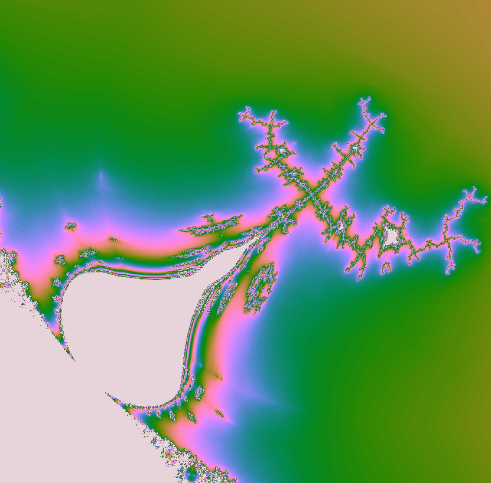

# Fract'ol

**Implementation of fractals:**

- Mandelbrot
- Julia
- Tricorn
- Tunel
- Burning ship
- Newton
- Church
- Balloons

**Mandelbrot zooming**


**Julia manipulations**


**Church fractal**



**Newtom fractal**


---

## Installation

- You have to download Minilibx library to run Fract'ol on your Mac.

### Clone

- Clone this repo to your local machine using `https://github.com/natqegu/fractol.git`

### Setup

> run the project using Makefile feature

```shell
$ make
```

> now you can run executable file 'fractol' with optional number of fractol [1-8]

```shell
$ ./fractol 1
```

> you can clean a workspace of object files, created during compilation

```shell
$ make clean
```

> and also delete every file created during compilation

```shell
$ make fclean
```

---

## FAQ

- **Can I run the project on Windows?**
    - No!